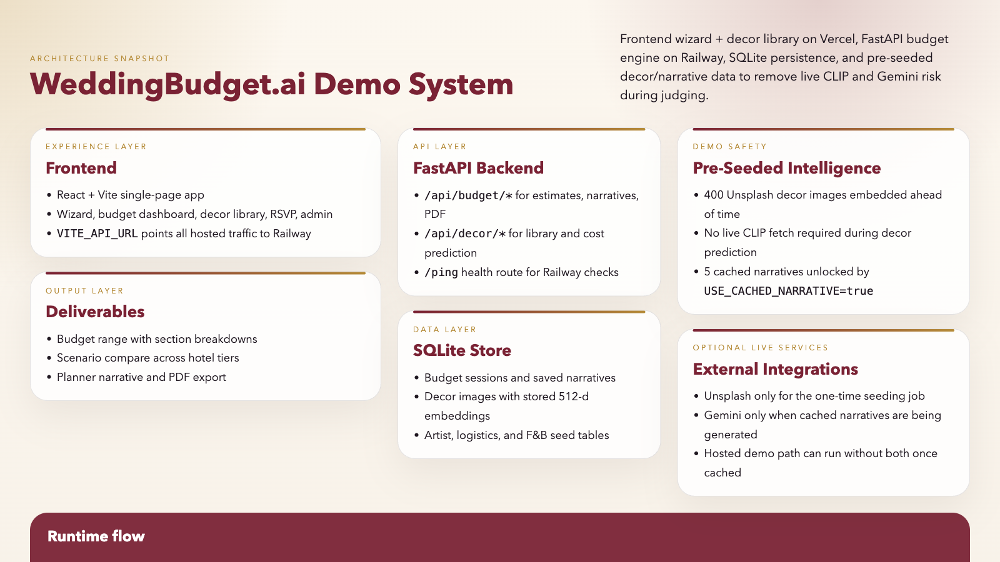

# WeddingBudget.ai

WeddingBudget.ai is a hackathon-ready planning platform for luxury Indian weddings. It combines a FastAPI budget engine, a React dashboard, decor intelligence hooks, PDF export, and a bonus RSVP workflow.



## Live URLs

- Backend (Railway): `TBD_AFTER_DEPLOY`
- Frontend (Vercel): `TBD_AFTER_DEPLOY`

## Stack

- Backend: FastAPI, SQLAlchemy, SQLite
- Frontend: React, Vite, Tailwind CSS, Recharts
- ML: CLIP-compatible embedding layer with local fallback, sklearn prediction
- Integrations: Gemini narrative generation, Unsplash decor ingestion

## Project structure

- `backend/`: API, models, routers, ML helpers, PDF utility
- `frontend/`: React app, wizard, results dashboard, decor library, admin, RSVP
- `scripts/seed_images.py`: batch-seeds decor images plus CLIP-compatible embeddings into SQLite
- `scripts/cache_narratives.py`: precomputes one narrative per hotel tier scenario
- `docs/product-demo.md`: demo notes and hosted verification checklist

## Local setup

### Backend

```bash
cd backend
python -m venv .venv
.venv\Scripts\activate
pip install -r requirements.txt
uvicorn main:app --reload
```

### Frontend

```bash
cd frontend
npm install
npm run dev
```

The Vite dev server proxies `/api` to `http://localhost:8000`.

## Environment

Copy `.env.example` to `.env` and fill in:

- `GEMINI_API_KEY`
- `UNSPLASH_ACCESS_KEY`
- `USE_CACHED_NARRATIVE=true` before the demo recording
- `VITE_API_URL` for production frontend builds

## Deploy And Seed

### Backend to Railway

`backend/Procfile` is already set for Railway:

```bash
web: uvicorn main:app --host 0.0.0.0 --port $PORT
```

Recommended Railway env vars:

- `GEMINI_API_KEY`
- `UNSPLASH_ACCESS_KEY`
- `USE_CACHED_NARRATIVE=true` for the recorded demo

### Frontend to Vercel

Set `VITE_API_URL` to the Railway backend URL, then deploy from `frontend/`:

```bash
vercel deploy --prod -y
```

### One-time demo safety jobs

```bash
python3 scripts/seed_images.py --total 400
python3 scripts/cache_narratives.py
```

## Key routes

- `POST /api/budget/estimate`
- `GET /api/budget/estimate/{session_id}`
- `POST /api/budget/narrative/{session_id}`
- `GET /api/budget/pdf/{session_id}`
- `GET /api/decor/library`
- `POST /api/decor/scrape/{function_type}`
- `POST /api/decor/predict/{id}`
- `GET /api/artists`
- `GET /api/logistics/estimate`
- `POST /api/rsvp/event`
- `POST /api/rsvp/respond`

## Notes

- Admin routes are intentionally unauthenticated for the hackathon prototype.
- Decor prediction now prefers stored embeddings so the hosted demo avoids live CLIP inference.
- The narrative endpoint can serve cached scenario text when `USE_CACHED_NARRATIVE=true`.
- Railway should use Python `3.11.9` because the ML stack is not a safe fit for Python `3.13`.
